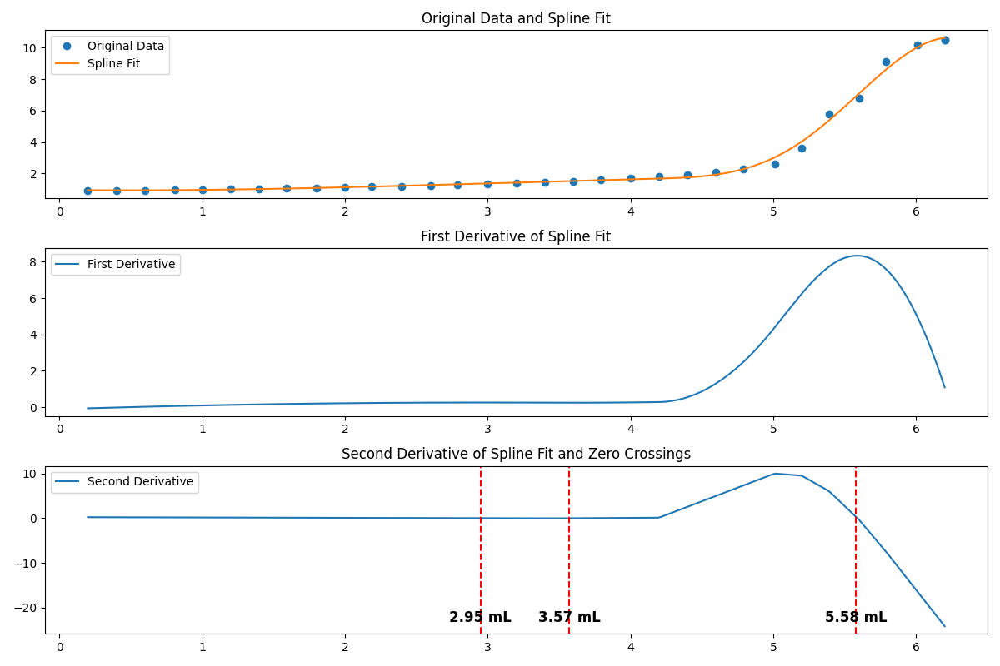

# Python Spline Analysis Tool

This Python script provides a comprehensive analysis of pH data in relation to volume, utilizing spline interpolation for smoothing and differentiation. It is designed to identify critical points in the dataset, such as inflection points, by analyzing the first and second derivatives of the spline fit to the data.

---

## Installation

### Prerequisites

Ensure you have Python installed on your system. This script has been tested with Python 3.8 and above. You can download Python from [https://www.python.org/downloads/](https://www.python.org/downloads/).

### Setting up a Virtual Environment

To keep dependencies isolated and maintain a clean Python environment, it is recommended to use a virtual environment.

1. **Create a Virtual Environment:**

   ```bash
   python -m venv venv
   ```

2. **Activate the Virtual Environment:**

   - On Windows:
     ```bash
     venv\Scripts\activate
     ```
   - On macOS/Linux:
     ```bash
     source venv/bin/activate
     ```

3. **Install Dependencies:**

   ```bash
   pip install numpy matplotlib scipy pandas
   ```

These libraries provide numerical operations (`numpy`), data handling (`pandas`), plotting capabilities (`matplotlib`), and spline interpolation functions (`scipy`).

---

## Usage

To use this script, you must have a CSV file containing your data with columns labeled `mL(x)` for volume and `pH(y)` for pH values. Then, run the script from the command line as follows:

```bash
python spline_analysis.py data_file.csv
```

Replace `spline_analysis.py` with the name of your script, and `data_file.csv` with the path to your data file.

---

## Background Mathematics

This tool employs spline interpolation, specifically using a Univariate Spline, to fit a smooth curve through the provided data points. Spline interpolation is a form of interpolation where the interpolant is a special type of piecewise polynomial called a spline. The primary advantage of spline interpolation is its ability to provide a smooth approximation to the data, which is particularly useful in avoiding the problem of Runge's phenomenon, common in high-degree polynomial interpolation.

### Univariate Spline

A Univariate Spline is a one-dimensional spline designed to fit a curve through a given set of points. The spline function is defined piecewise on subintervals, with the degree of the spline (typically cubic) and the smoothness of the curve being adjustable parameters.

### Derivatives and Zero Crossings

The script calculates the first and second derivatives of the spline to analyze the rate of change and the concavity of the fitted curve, respectively. By examining the second derivative, we can identify points of inflection where the concavity changes (i.e., where the second derivative crosses zero). These points are critical for understanding the behavior of the data, such as identifying transition points in a titration curve.

---

## Output

The script outputs a series of plots:

- The original data with the spline fit overlayed.
- The first derivative of the spline fit.
- The second derivative of the spline fit with zero crossings marked.

Additionally, it prints the approximate volumes at which zero crossings occur, indicative of inflection points in the data.

---

## Example Output



---

## License

This project is licensed under the MIT License. Feel free to use and modify it for your own purposes.
