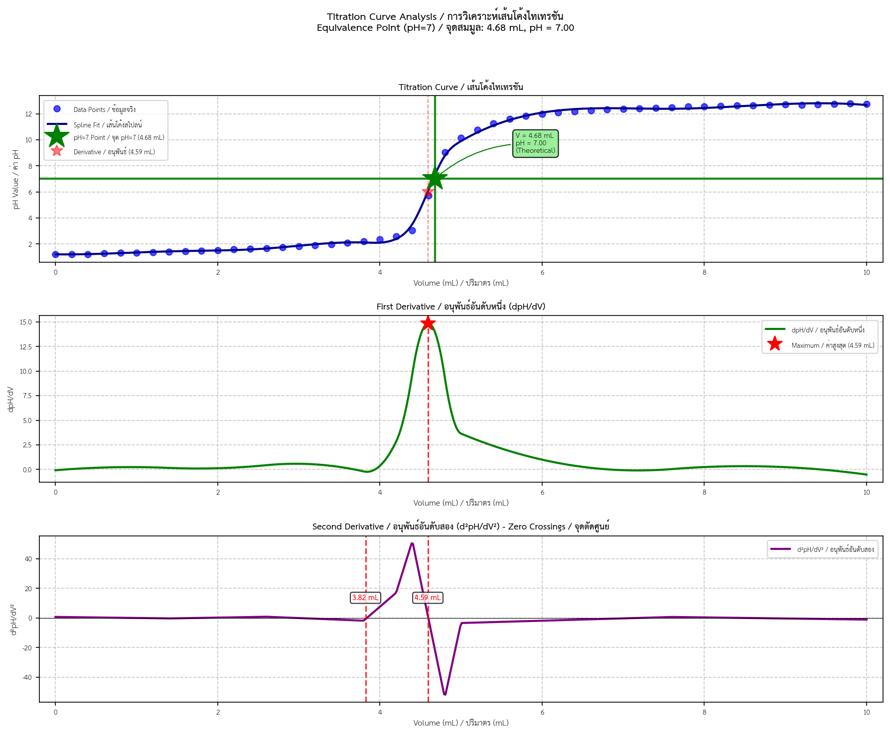

# EquivPoint - เครื่องมือหาจุดสมมูล (Equivalence Point Finder)

## ภาพรวม (Overview)

EquivPoint เป็นเครื่องมือวิเคราะห์ข้อมูลการไทเทรต (titration data analysis tool) ที่พัฒนาด้วย Python สำหรับหาจุดสมมูล (equivalence point) จากข้อมูลที่บันทึกโดยบอร์ด TitraLab

โปรแกรมนี้ใช้เทคนิค Spline Interpolation ในการปรับเส้นโค้งให้เรียบ และคำนวณอนุพันธ์อันดับหนึ่งและอันดับสอง (first and second derivatives) เพื่อระบุจุดสมมูลจากจุดเปลี่ยนเว้า (inflection point) ของกราฟไทเทรชัน

This Python tool analyzes titration data recorded by the TitraLab ESP32 board. It uses spline interpolation to smooth the titration curve and calculates derivatives to identify the equivalence point where the curve shows maximum rate of pH change.

---

## ขั้นตอนการทำงานกับ TitraLab (TitraLab Workflow)

### 1. บันทึกข้อมูลจากบอร์ด TitraLab (Recording Data from TitraLab Board)

ข้อมูลการไทเทรตจะถูกบันทึกลงใน ESP32 flash storage ของบอร์ด TitraLab โดยอัตโนมัติระหว่างการทดลอง ไฟล์จะถูกตั้งชื่อตามรูปแบบ:

- `titration_data_R1.csv` - การทดลองซ้ำครั้งที่ 1 (Replicate 1)
- `titration_data_R2.csv` - การทดลองซ้ำครั้งที่ 2 (Replicate 2)
- `titration_data_R3.csv` - การทดลองซ้ำครั้งที่ 3 (Replicate 3)

### 2. ดาวน์โหลดไฟล์ผ่าน Thonny IDE (Downloading Files via Thonny)

1. เชื่อมต่อบอร์ด TitraLab กับคอมพิวเตอร์ผ่านสาย USB
2. เปิด Thonny IDE และเชื่อมต่อกับ ESP32
3. ในหน้าต่าง Files คลิกขวาที่ไฟล์ CSV บน ESP32
4. เลือก "Download to..." และบันทึกลงในโฟลเดอร์ `EquivPoint`

### 3. วิเคราะห์ข้อมูลด้วย EquivPoint (Analyzing with EquivPoint)

รันโปรแกรมวิเคราะห์ตามขั้นตอนด้านล่าง

---

## การติดตั้ง (Installation)

### ข้อกำหนดเบื้องต้น (Prerequisites)

ต้องติดตั้ง Python 3.8 ขึ้นไปในคอมพิวเตอร์ สามารถดาวน์โหลดได้จาก [https://www.python.org/downloads/](https://www.python.org/downloads/)

### การสร้าง Virtual Environment

การใช้ Virtual Environment ช่วยแยกไลบรารีของโปรเจกต์นี้ออกจากระบบหลัก เพื่อป้องกันปัญหาความขัดแย้งของเวอร์ชัน

Using a virtual environment isolates this project's libraries from your system Python, preventing version conflicts.

1. **สร้าง Virtual Environment (Create Virtual Environment):**

   ```bash
   cd EquivPoint
   python -m venv venv
   ```

2. **เปิดใช้งาน Virtual Environment (Activate Virtual Environment):**

   - บน Windows:
     ```bash
     venv\Scripts\activate
     ```
   - บน macOS/Linux:
     ```bash
     source venv/bin/activate
     ```

   เมื่อเปิดใช้งานสำเร็จ จะเห็น `(venv)` ปรากฏหน้า command prompt

3. **ติดตั้งไลบรารีที่จำเป็น (Install Dependencies):**

   ```bash
   pip install numpy matplotlib scipy pandas
   ```

   | ไลบรารี | หน้าที่ |
   |---------|--------|
   | `numpy` | การคำนวณเชิงตัวเลข (numerical operations) |
   | `pandas` | การจัดการข้อมูล CSV (data handling) |
   | `matplotlib` | การสร้างกราฟ (plotting) |
   | `scipy` | ฟังก์ชัน Spline Interpolation |

---

## การใช้งาน (Usage)

### คำสั่งพื้นฐาน (Basic Command)

```bash
python equiv_point.py titration_data_R1.csv
```

แทนที่ `titration_data_R1.csv` ด้วยชื่อไฟล์ข้อมูลของคุณ

### ตัวอย่างการใช้งาน (Example)

```bash
# เปิดใช้งาน virtual environment ก่อน (Activate virtual environment first)
venv\Scripts\activate

# รันโปรแกรมวิเคราะห์ (Run analysis)
python equiv_point.py titration_data_R1.csv
```

---

## รูปแบบไฟล์ CSV (CSV Format)

ไฟล์ CSV ต้องมีคอลัมน์ตามรูปแบบนี้:

| คอลัมน์ | ความหมาย | หน่วย |
|---------|----------|-------|
| `Volume (mL)` | ปริมาตรสารไทแทรนต์ที่เติม | มิลลิลิตร |
| `pH Value` | ค่า pH ที่วัดได้ | - |

### ตัวอย่างไฟล์ CSV (Example CSV File)

```csv
Volume (mL),pH Value
0.000,1.188
0.200,1.215
0.400,1.224
0.600,1.272
...
4.400,3.026
4.600,5.730
4.800,9.037
5.000,10.161
...
```

**หมายเหตุ:** ไฟล์ที่บันทึกจากบอร์ด TitraLab จะมีรูปแบบนี้อยู่แล้วโดยอัตโนมัติ ไม่ต้องแก้ไขอะไรเพิ่มเติม

---

## หลักการทางคณิตศาสตร์ (Mathematical Background)

### ทำไมต้องใช้ Spline? (Why Spline?)

ในการวิเคราะห์เส้นโค้งไทเทรชัน เราต้องการ:
1. เส้นโค้งที่เรียบผ่านจุดข้อมูล
2. สามารถหาอนุพันธ์ได้อย่างแม่นยำ
3. ไม่เกิดการแกว่ง (oscillation) ในบริเวณที่ข้อมูลเปลี่ยนแปลงเร็ว

**ปัญหาของ Polynomial Fitting:**

```
ถ้าใช้ polynomial ดีกรีสูง (เช่น degree = 10) เพื่อ fit ข้อมูล 10 จุด:
- เส้นโค้งจะผ่านทุกจุดพอดี
- แต่จะเกิดการแกว่งรุนแรงระหว่างจุด (Runge's phenomenon)
- อนุพันธ์จะผิดพลาดมาก
```

**ข้อดีของ Spline:**

```
Spline ใช้ polynomial ดีกรีต่ำ (ปกติ degree = 3, cubic spline) หลายชิ้นต่อกัน:
- แต่ละช่วงใช้ polynomial แยกกัน
- ต่อกันอย่างเรียบ (ความชันและความโค้งต่อเนื่อง)
- ไม่เกิดการแกว่ง
```

### Cubic Spline คืออะไร? (What is Cubic Spline?)

Cubic Spline คือเส้นโค้งที่ประกอบด้วย polynomial กำลัง 3 หลายชิ้นต่อกัน:

```
สำหรับช่วง [x_i, x_{i+1}]:
    S_i(x) = a_i + b_i(x - x_i) + c_i(x - x_i)² + d_i(x - x_i)³

เงื่อนไขความต่อเนื่อง (Continuity Conditions):
    1. S_i(x_{i+1}) = S_{i+1}(x_{i+1})     → ค่าต่อเนื่อง
    2. S'_i(x_{i+1}) = S'_{i+1}(x_{i+1})   → ความชันต่อเนื่อง
    3. S''_i(x_{i+1}) = S''_{i+1}(x_{i+1}) → ความโค้งต่อเนื่อง
```

### Smoothing Factor (ค่าปรับความเรียบ)

โปรแกรมใช้ `UnivariateSpline` จาก SciPy ซึ่งมี smoothing factor (`s`):

| ค่า s | ผลลัพธ์ | เหมาะกับ |
|-------|--------|---------|
| `s = 0` | ผ่านทุกจุดพอดี (interpolation) | ข้อมูลไม่มี noise |
| `s = 0.5-1.0` | เรียบปานกลาง | ข้อมูลมี noise เล็กน้อย |
| `s > 2.0` | เรียบมาก | ข้อมูลมี noise มาก |

```python
# ในโค้ด equiv_point.py ใช้ค่า s = 1.0
spline = UnivariateSpline(volume, pH, s=1.0)
```

**หมายเหตุ:** ค่า `s` ที่สูงเกินไปอาจทำให้สูญเสียรายละเอียดในบริเวณจุดสมมูล

### การหาจุดสมมูลด้วยอนุพันธ์ (Finding Equivalence Point with Derivatives)

```
จุดสมมูล = จุดที่ |dpH/dV| มีค่าสูงสุด = จุดที่ d²pH/dV² = 0
```

#### อนุพันธ์อันดับหนึ่ง (First Derivative, dpH/dV)

แสดงอัตราการเปลี่ยนแปลง pH ต่อปริมาตร:

```
dpH/dV = lim[ΔV→0] (ΔpH / ΔV)

ที่จุดสมมูล: |dpH/dV| มีค่าสูงสุด (maximum rate of change)
```

**ความหมายทางเคมี:** บริเวณจุดสมมูล pH เปลี่ยนแปลงเร็วที่สุดเพราะ:
- ก่อนจุดสมมูล: มี buffer capacity จากกรด/เบสที่เหลือ
- ที่จุดสมมูล: ไม่มี buffer → pH เปลี่ยนแปลงรุนแรง
- หลังจุดสมมูล: มี buffer capacity จากกรด/เบสส่วนเกิน

#### อนุพันธ์อันดับสอง (Second Derivative, d²pH/dV²)

แสดงอัตราการเปลี่ยนแปลงของความชัน:

```
d²pH/dV² = d/dV (dpH/dV)

ที่จุดสมมูล: d²pH/dV² = 0 (จุดเปลี่ยนเว้า / inflection point)
```

**ความหมาย:**
- `d²pH/dV² > 0`: เส้นโค้งเว้าขึ้น (concave up) ↗
- `d²pH/dV² < 0`: เส้นโค้งเว้าลง (concave down) ↘
- `d²pH/dV² = 0`: จุดเปลี่ยนเว้า (inflection point)

### วิธีพิเศษสำหรับกรดแก่-เบสแก่ (Strong Acid-Strong Base Method)

สำหรับการไทเทรต HCl + NaOH จุดสมมูลทางทฤษฎีคือ **pH = 7.0**:

```
ที่จุดสมมูล: n(H⁺) = n(OH⁻)
           [H⁺] = [OH⁻] = √Kw = 10⁻⁷ M
           pH = 7.00 (ที่ 25°C)
```

โปรแกรมจะหาจุดที่ pH = 7.0 โดย linear interpolation จากข้อมูลดิบ:

```python
# Linear interpolation หาจุดที่ pH = 7
V_eq = V_i + (7.0 - pH_i) × (V_{i+1} - V_i) / (pH_{i+1} - pH_i)
```

**ข้อดี:** แม่นยำกว่าวิธี derivative เมื่อข้อมูลในบริเวณจุดสมมูลห่างกัน

### เปรียบเทียบวิธีการหาจุดสมมูล (Method Comparison)

| วิธี | หลักการ | ข้อดี | ข้อจำกัด |
|-----|--------|------|---------|
| **1st Derivative Max** | หาจุดที่ \|dpH/dV\| สูงสุด | ใช้ได้กับทุกประเภท | อาจคลาดเคลื่อนถ้าข้อมูลห่าง |
| **2nd Derivative Zero** | หาจุดที่ d²pH/dV² = 0 | ยืนยันจุดเปลี่ยนเว้า | อาจมีหลายจุด |
| **pH = 7 Crossing** | Interpolation หา pH = 7 | แม่นยำสำหรับ strong acid-base | ใช้ได้เฉพาะกรดแก่-เบสแก่ |

---

## ผลลัพธ์ที่ได้ (Output)

### กราฟที่แสดง (Generated Plots)

โปรแกรมจะแสดงกราฟ 3 ส่วน:

1. **กราฟบน:** ข้อมูลดิบ (จุด) และเส้น Spline Fit (Original Data and Spline Fit)
2. **กราฟกลาง:** อนุพันธ์อันดับหนึ่ง (First Derivative)
3. **กราฟล่าง:** อนุพันธ์อันดับสองพร้อมเส้นแนวตั้งที่จุด Zero Crossing (Second Derivative with Zero Crossings)

### ผลลัพธ์ใน Terminal

```
Approximate volume at zero crossing: 4.52 mL
```

ค่านี้คือปริมาตรที่จุดสมมูล ซึ่งใช้ในการคำนวณความเข้มข้นของสารตัวอย่าง

### ตัวอย่างกราฟ (Example Output)



---

## การตีความผลลัพธ์ (Interpreting Results)

### จุดสมมูลคืออะไร? (What is the Equivalence Point?)

จุดสมมูล (equivalence point) คือจุดที่จำนวนโมลของกรดเท่ากับจำนวนโมลของเบส:

```
n(acid) = n(base)
M_acid × V_acid = M_base × V_base
```

### การคำนวณความเข้มข้น (Calculating Concentration)

เมื่อทราบปริมาตรที่จุดสมมูล (V_eq) สามารถคำนวณความเข้มข้นของสารตัวอย่างได้:

**ตัวอย่าง:** ไทเทรต HCl (สารตัวอย่าง) 10.00 mL ด้วย NaOH 0.100 M

```
ถ้า V_eq = 4.52 mL

M_HCl = (M_NaOH × V_NaOH) / V_HCl
M_HCl = (0.100 M × 4.52 mL) / 10.00 mL
M_HCl = 0.0452 M
```

### สิ่งที่ควรสังเกต (What to Look For)

| สิ่งที่สังเกต | ความหมาย |
|--------------|----------|
| Zero crossing ชัดเจน | การไทเทรตมีคุณภาพดี มีจุดสมมูลชัดเจน |
| มี zero crossing หลายจุด | อาจเป็น polyprotic acid หรือมีสิ่งรบกวน |
| ไม่มี zero crossing ชัดเจน | ข้อมูลมี noise มาก หรือไม่ถึงจุดสมมูล |

---

## การแก้ปัญหา (Troubleshooting)

### ปัญหาที่พบบ่อย (Common Issues)

#### 1. `FileNotFoundError: [Errno 2] No such file or directory`

**สาเหตุ:** ไม่พบไฟล์ CSV ในตำแหน่งที่ระบุ

**วิธีแก้:**
- ตรวจสอบว่าไฟล์ CSV อยู่ในโฟลเดอร์เดียวกับ `equiv_point.py`
- ตรวจสอบชื่อไฟล์ให้ถูกต้อง (ตัวพิมพ์เล็ก/ใหญ่)
- ใช้ path เต็มถ้าไฟล์อยู่ในโฟลเดอร์อื่น

#### 2. `KeyError: 'Volume (mL)'` หรือ `KeyError: 'pH Value'`

**สาเหตุ:** ไฟล์ CSV มีชื่อคอลัมน์ไม่ตรงกับที่โปรแกรมต้องการ

**วิธีแก้:**
- เปิดไฟล์ CSV และตรวจสอบชื่อคอลัมน์
- ต้องมีคอลัมน์ชื่อ `Volume (mL)` และ `pH Value` ตามตัวอักษรเป๊ะ
- ถ้าใช้ชื่ออื่น ให้แก้ไขบรรทัดแรกของไฟล์ CSV

#### 3. `ModuleNotFoundError: No module named 'numpy'`

**สาเหตุ:** ยังไม่ได้ติดตั้งไลบรารีที่จำเป็น หรือไม่ได้เปิดใช้ virtual environment

**วิธีแก้:**
```bash
# เปิดใช้ virtual environment ก่อน
venv\Scripts\activate

# ติดตั้งไลบรารี
pip install numpy matplotlib scipy pandas
```

#### 4. กราฟแสดง Zero Crossing หลายจุดเกินไป

**สาเหตุ:** ข้อมูลมี noise มาก หรือค่า smoothing factor ไม่เหมาะสม

**วิธีแก้:**
- ตรวจสอบว่าการสอบเทียบ pH probe ถูกต้อง
- ลองกรองข้อมูลที่ผิดปกติออกก่อนวิเคราะห์
- จุดสมมูลที่แท้จริงมักอยู่ในบริเวณที่ pH เปลี่ยนแปลงรวดเร็ว

#### 5. ไม่พบจุด Zero Crossing

**สาเหตุ:** อาจยังไทเทรตไม่ถึงจุดสมมูล หรือข้อมูลมีปัญหา

**วิธีแก้:**
- ตรวจสอบว่าเติมสารไทแทรนต์เพียงพอจนผ่านจุดสมมูล
- ดูกราฟว่ามีรูปร่างเป็น S-curve หรือไม่
- ถ้าไม่เห็น S-curve อาจต้องทำการทดลองใหม่

---

## ตัวอย่างไฟล์ข้อมูล (Sample Data Files)

โฟลเดอร์นี้มีไฟล์ตัวอย่างสำหรับทดสอบ:

- `data.csv` - ข้อมูลตัวอย่างทั่วไป
- `titration_data_R1.csv` - ข้อมูลจริงจากการทดลอง

ลองรันโปรแกรมกับไฟล์เหล่านี้เพื่อทำความเข้าใจการทำงาน:

```bash
python equiv_point.py titration_data_R1.csv
```

---

## ข้อมูลเพิ่มเติม (Additional Resources)

- เอกสารประกอบการเรียนวิชา 2302311 Integrated Chemistry Laboratory I
- คู่มือการใช้งานบอร์ด TitraLab
- MicroPython examples ใน `../MicroPython/Week_3/`

---

## License

This project is licensed under the MIT License. Feel free to use and modify it for educational purposes.
