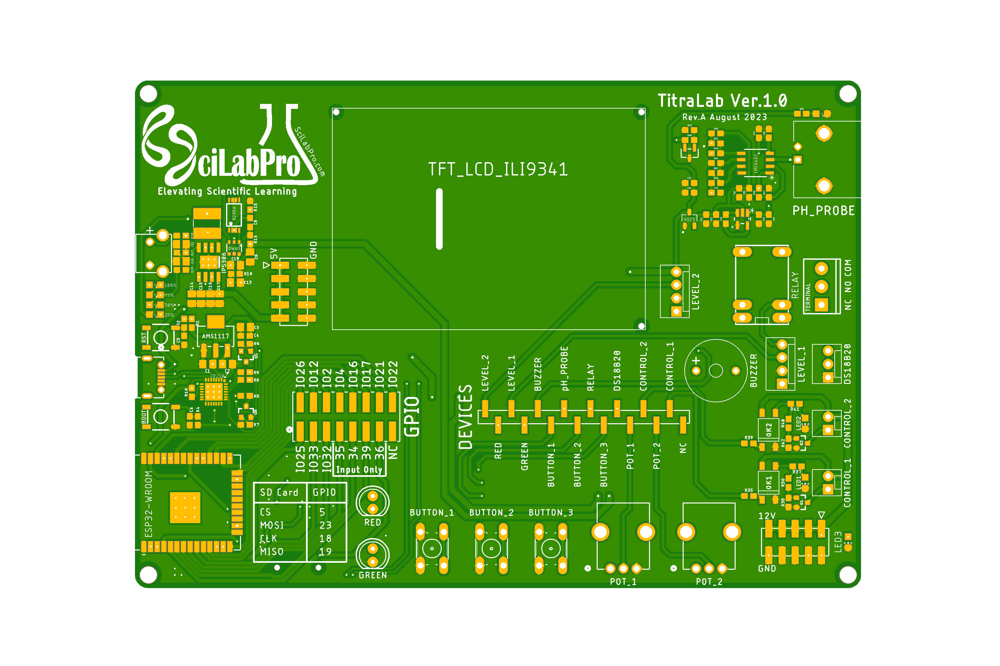

# TitraLab

[](LICENSE)
[](MicroPython/README.md)
[](https://testflight.apple.com/join/bMWSYuD3)

<p align="center">
  
</p>

## ภาพรวม (Overview)

**TitraLab** คือบอร์ดพัฒนาสำหรับการศึกษาที่ออกแบบโดย รศ.ดร.วิวัฒน์ วชิรวงศ์กวิน และ ศ.ดร.สัมฤทธิ์ วัชรสินธุ์ เพื่อยกระดับประสบการณ์การเรียนรู้ในสาขาเคมี บอร์ดนี้ใช้ไมโครคอนโทรลเลอร์ ESP32 เป็นแกนหลัก และมีบทบาทสำคัญในรายวิชา 2302311 Integrated Chemistry Laboratory I ในหัวข้อ "Advanced Acid-Base Titrations with Automated Flow System"

TitraLab is an educational development board designed by Associate Professor Dr. Viwat Vchirawongkwin and Professor Dr. Sumrit Wacharasindhu to enhance the learning experience in the field of chemistry. At its core, TitraLab utilizes the ESP32 microcontroller, renowned for its versatility and robust performance. This project plays a pivotal role in the Integrated Chemistry Laboratory I (2302311) course, particularly in the module titled "Advanced Acid-Base Titrations with Automated Flow System."

> 🖼️ ภาพบอร์ดด้านล่างและแผงวงจร (schematic) ฉบับเต็ม 5 แผ่น ดูได้ที่โฟลเดอร์ [`imgs/`](imgs/)
> (Bottom view and the complete 5-sheet schematic are available in the [`imgs/`](imgs/) folder.)

---

## 📱 แอปคู่หู SciLabPro MicroPad (Companion App)

**SciLabPro MicroPad** คือแอปพลิเคชันคู่หูของบอร์ด TitraLab Ver. 1.0 ที่เปลี่ยนแท็บเล็ตให้เป็นสถานีเขียนโปรแกรม MicroPython แบบครบวงจร — จับคู่กับบอร์ดผ่าน Bluetooth Low Energy (BLE) โดยสแกน QR code ที่แสดงบนจอ TFT ของบอร์ด จากนั้นเขียนโค้ดด้วย Python หรือ Blockly, อัปโหลดและรันโค้ดบนบอร์ด, ดู console แบบสด, สอบเทียบเซ็นเซอร์, นำเข้าบทเรียน และดูกราฟข้อมูลได้ในแอปเดียว

**SciLabPro MicroPad** is a tablet-first coding and lab-automation companion for the TitraLab Ver. 1.0 board. It turns an iPad into a complete MicroPython workstation: pair with the board over Bluetooth Low Energy (BLE) by scanning the QR code shown on the board's TFT display, then edit code in Python or Blockly, upload and run it on the board, watch live console output, calibrate sensors, import lessons, and visualize data — all in one app.

### 🧪 ร่วมทดสอบรุ่นเบต้าผ่าน TestFlight (Join the Beta via TestFlight)

| ขั้นตอน | Step |
|:--------|:-----|
| 1. ติดตั้งแอป **TestFlight** จาก App Store บน iPhone หรือ iPad | Install **TestFlight** from the App Store |
| 2. สแกน QR code ด้านล่าง หรือเปิดลิงก์บนอุปกรณ์ของคุณ | Scan the QR code below, or open the link on your device |
| 3. แตะ **Accept** แล้วแตะ **Install** | Tap **Accept**, then tap **Install** |

**ลิงก์สำหรับผู้ทดสอบ (Public tester link):** <https://testflight.apple.com/join/bMWSYuD3>

<p align="center">
  <a href="https://testflight.apple.com/join/bMWSYuD3">
    
  </a>
</p>

> 📌 แอปออกแบบมาใช้งานคู่กับบอร์ด TitraLab Ver. 1.0 — แนะนำให้ใช้ iPad เพื่อประสบการณ์ที่ดีที่สุด
> (The app is designed to work with TitraLab Ver. 1.0 hardware — an iPad is recommended for the best experience.)
>
> 🔒 นโยบายความเป็นส่วนตัว (Privacy policy): [privacy_policy.md](privacy_policy.md) — แอปทำงานแบบออฟไลน์ ไม่เก็บข้อมูลบนเซิร์ฟเวอร์ (offline-first, no data collected on servers; เอกสารฉบับปัจจุบันเขียนอ้างอิงรุ่น Android / the current policy text covers the Android build)

---

## วัตถุประสงค์ (Purpose)

วัตถุประสงค์หลักของ TitraLab คือการแนะนำนิสิตให้รู้จักการประยุกต์ใช้การเขียนโปรแกรมในการวิเคราะห์ทางเคมีและระบบอัตโนมัติในห้องปฏิบัติการ บอร์ดนี้เป็นเครื่องมือการศึกษาสำหรับการทำความเข้าใจและการนำระบบไทเทรตอัตโนมัติไปใช้งาน ซึ่งเป็นกระบวนการพื้นฐานในเคมีวิเคราะห์ ผ่านประสบการณ์จริงกับ TitraLab นิสิตจะได้รับข้อมูลเชิงลึกที่มีคุณค่าเกี่ยวกับการบูรณาการฮาร์ดแวร์และซอฟต์แวร์ในการวิจัยทางวิทยาศาสตร์

The primary objective of TitraLab is to introduce students to the practical applications of programming in chemical analysis and laboratory automation. It serves as an educational tool in understanding and implementing automated titrations, a fundamental process in analytical chemistry. Through hands-on experience with TitraLab, students gain valuable insights into the integration of hardware and software in scientific research.

---

## คุณสมบัติหลัก (Key Features)

- **ไมโครคอนโทรลเลอร์ (Microcontroller):** ESP32
- **การเขียนโปรแกรม (Programming):** MicroPython ผ่านแอป **SciLabPro MicroPad** (แท็บเล็ต + BLE) หรือ **Thonny IDE** (คอมพิวเตอร์ + USB)
- **จอแสดงผล (Display):** จอ TFT ขนาด 2.4 นิ้ว พร้อมไดรเวอร์ ili9341
- **เซ็นเซอร์และตัวบ่งชี้ (Sensors & Indicators):**
  - LED สีแดงและสีเขียวสำหรับแสดงสถานะ
  - เซ็นเซอร์อุณหภูมิ DS18B20
  - ขั้วต่อ BNC สำหรับหัววัด pH พร้อมวงจรขยายสัญญาณมิลลิโวลต์ความแม่นยำสูง
- **การจัดเก็บข้อมูล (Storage):** บันทึกลงหน่วยความจำแฟลชของ ESP32 ที่ `/workspace/data/` — ดูผลสดในแอป MicroPad หรือดาวน์โหลดผ่าน Thonny IDE
- **เสียง (Sound):** Buzzer บนบอร์ด
- **ปั๊ม (Pump):** ปั๊มเพอริสตาลติกสำหรับการเติมสารไทแทรนต์อัตโนมัติ (ขับผ่าน optocoupler + MOSFET, ราง 12V)
- **การออกแบบเชิงการสอน (Pedagogical design):** GPIO header และ DEVICES header แยกจากกัน — นิสิตเลือกขา GPIO และต่อสายจัมเปอร์เอง (ดูหัวข้อ [การกำหนดขา GPIO](#การกำหนดขา-gpio-gpio-pin-configuration))

---

## เริ่มต้นอย่างรวดเร็ว (Quick Start)

### เลือกเส้นทางการเขียนโปรแกรม (Choose Your Workflow)

| เส้นทาง | เครื่องมือ | เหมาะสำหรับ |
|:-------:|-----------|-------------|
| **A** (แนะนำ) | แอป **MicroPad** บน iPad — [ติดตั้งผ่าน TestFlight](#-ร่วมทดสอบรุ่นเบต้าผ่าน-testflight-join-the-beta-via-testflight) | ใช้ในคาบปฏิบัติการ: จับคู่บอร์ดด้วยการสแกน QR บนจอ TFT, นำเข้าบทเรียน (ดูวิธีใน[คู่มือผู้ใช้](MicroPython/Week_3/USER_MANUAL.md)), รันโค้ด และดูผลสดผ่าน BLE |
| **B** | **Thonny IDE** บนคอมพิวเตอร์ — [คู่มือติดตั้งและแก้ปัญหา](MicroPython/Week_1/README.md) | เขียนโค้ดผ่านสาย USB, จัดการไฟล์บนบอร์ด, ดาวน์โหลดข้อมูล CSV |

### บทเรียนรายสัปดาห์ (Weekly Lessons)

| สัปดาห์ | เริ่มต้นที่ | คำอธิบาย |
|:-------:|-------------|----------|
| **ภาพรวม** | [MicroPython/README.md](MicroPython/README.md) | ภาพรวมหลักสูตร 3 สัปดาห์, สิ่งที่ต้องเตรียม, เกณฑ์ความสำเร็จ |
| **1** | [MicroPython/Week_1/README.md](MicroPython/Week_1/README.md) | รู้จักบอร์ด, GPIO, ADC, PWM, OOP พื้นฐาน |
| **2** | [MicroPython/Week_2/README.md](MicroPython/Week_2/README.md) | สอบเทียบ pH และอัตราการไหล, OOP ขั้นกลาง |
| **3** | [MicroPython/Week_3/README.md](MicroPython/Week_3/README.md) | ไทเทรตอัตโนมัติเต็มรูปแบบ — พร้อม[คู่มือผู้ใช้](MicroPython/Week_3/USER_MANUAL.md)และ[คู่มือปฏิบัติการ](MicroPython/Week_3/LAB_DIRECTION.md) |
| **วิเคราะห์** | [EquivPoint/README.md](EquivPoint/README.md) | หาจุดสมมูลด้วย Spline และ Derivative |

---

## โครงสร้างรายวิชา (Course Structure)

### สัปดาห์ที่ 1: รู้จักบอร์ด TitraLab (Introduction to TitraLab Programming)

- **Blink:** เข้าใจ GPIO ของ ESP32 ในโหมด OUTPUT โดยใช้ LED บนบอร์ด
- **Button:** เรียนรู้ GPIO ของ ESP32 ในโหมด INPUT (ขา input-only 34/35/39 พร้อมวงจร debounce บนบอร์ด)
- **ADC:** อ่านค่าแอนะล็อกด้วยโพเทนชิออมิเตอร์ (POT_1 ใช้จำลองสัญญาณ pH ก่อนใช้หัววัดจริง)
- **DS18B20:** อ่านค่าอุณหภูมิด้วยโปรโตคอล 1-wire
- **TFT Display:** ใช้งานไดรเวอร์ ili9341 สำหรับแสดงข้อมูล
- **Buzzer:** ใช้งาน buzzer บนบอร์ด (รวมตัวอย่างเพลงมหาจุฬาลงกรณ์)
- **OOP พื้นฐาน:** Class, Object, Constructor, Method — บทเรียนหลัก 9 ไฟล์ใน [`core/`](MicroPython/Week_1/core/) และแบบเรียนเสริมใน [`extras/`](MicroPython/Week_1/extras/)

### สัปดาห์ที่ 2: การสอบเทียบและ OOP ขั้นกลาง (Calibration and Advanced OOP)

- **การวัด pH:** เข้าใจสมการ Nernst และการใช้หัววัด pH ที่เชื่อมต่อผ่าน BNC
- **Linear Regression:** ทบทวนวิธีการและสมการ (เป้าหมาย R² ≥ 0.99)
- **เป้าหมายเชิงปฏิบัติ:**
  - สอบเทียบหัววัด pH แบบ 3 จุด (บัฟเฟอร์ pH 4, 7, 10) → บันทึกที่ `/workspace/data/ph_calibration.txt`
  - สอบเทียบอัตราการไหลของปั๊มเพอริสตาลติก (เป้าหมาย %RSD < 5%) → บันทึกที่ `/workspace/data/flow_calibration.txt`
- **OOP ขั้นกลาง:** Inheritance, Composition, @property — ใน [`03_OOP_Advanced/`](MicroPython/Week_2/03_OOP_Advanced/)

> ⚠️ ไฟล์สอบเทียบทั้งสองจากสัปดาห์นี้เป็น **ข้อกำหนดเบื้องต้นของสัปดาห์ที่ 3** — โปรแกรมไทเทรตจะตรวจสอบและหยุดทำงานก่อนจ่ายสารหากไม่พบไฟล์

### สัปดาห์ที่ 3: ระบบไทเทรตอัตโนมัติเต็มรูปแบบ (Full Automated Titration)

บทเรียนแบบ **Lean สำหรับ MicroPad** — ไดรเวอร์ฮาร์ดแวร์อยู่ในเฟิร์มแวร์ของบอร์ด (เรียกใช้ผ่าน `import scilabpro as slp`) นิสิตจึงมุ่งเน้นที่ตรรกะการไทเทรตโดยตรง ประกอบด้วยไฟล์ Python เพียง 3 ไฟล์:

| ไฟล์ | หน้าที่ |
|------|---------|
| [`01_titration_auto.py`](MicroPython/Week_3/01_titration_auto.py) | โปรแกรมหลัก — ควบคุมการไทเทรตและบันทึกข้อมูล |
| [`titration.py`](MicroPython/Week_3/titration.py) | โมดูลเคมี — โหลดค่าสอบเทียบ, ตรวจจับจุดสมมูล (max \|dpH/dV\|) |
| [`experiment.py`](MicroPython/Week_3/experiment.py) | ค่าคงที่การทดลอง (ปริมาตรต่อโดส, ความเข้มข้นไทแทรนต์ ฯลฯ) |

- **การทดลอง:** ไทเทรตระหว่าง HCl และ NaOH เปรียบเทียบจุดสมมูลกับการเปลี่ยนสีของ phenolphthalein indicator
- **การแสดงผล:** แอป MicroPad (ผ่าน BLE) เป็นจอหลัก — ดูสถานะ กราฟ และผลการทดลองแบบสด ส่วนจอ TFT บนบอร์ดแสดง dashboard ประกอบ
- **การจัดเก็บข้อมูล:** บันทึกอัตโนมัติเป็น `/workspace/data/titration_data_R1.csv`, `R2`, ... (เลขรันเพิ่มอัตโนมัติ และบันทึกข้อมูลบางส่วนแม้หยุดกลางคัน)
- **ต้นแบบ:** พัฒนาต่อยอดจากโครงงานของนางสาวเหมวรรณ สาออน และนายณัฐกิตติ์ ดีมอญ (ดู [`MicroPython/SeniorProject/`](MicroPython/SeniorProject/))

> 🚫 **ห้ามคัดลอกหรือเปลี่ยนชื่อไฟล์บทเรียนเป็น `/workspace/main.py`** — เฟิร์มแวร์จะรัน `main.py` อัตโนมัติทุกครั้งที่บูตเครื่อง ซึ่งอาจทำให้ปั๊มจ่ายสารเองโดยไม่มีผู้ดูแล

---

## การกำหนดขา GPIO (GPIO Pin Configuration)

### หลักคิด: นิสิตเลือกขาเอง (Design Philosophy: Students Choose Their Pins)

บอร์ด TitraLab ออกแบบให้ **GPIO header** (ขาจาก ESP32 โดยตรง) และ **DEVICES header** (สัญญาณอุปกรณ์บนบอร์ด) **แยกจากกัน** — นิสิตต้องต่อสายจัมเปอร์ระหว่างสอง header เอง โดยเลือกขา GPIO ให้เหมาะกับคุณสมบัติที่อุปกรณ์ต้องการ (OUTPUT / INPUT / ADC / PWM) นี่คือหัวใจของการเรียนรู้เชิงวิศวกรรม: *ขาไหนใช้ทำอะไรได้ และเพราะอะไร*

The GPIO header and DEVICES header are intentionally separate — students wire them together with jumper wires, choosing each GPIO based on the capability the device requires. Only the TFT display and SD card are hardwired on the PCB.

### ขาที่บัดกรีตายตัวบน PCB (Hardwired Pins — Cannot Change)

| กลุ่ม | สัญญาณ | GPIO |
|-------|--------|:----:|
| จอ TFT (SPI) | SCK / MOSI / DC / CS / RST | 14 / 13 / 27 / 15 / 0 |
| SD Card (SPI) | MISO / MOSI / SCK / CS | 19 / 23 / 18 / 5 |

### สัญญาณบน DEVICES Header และผังมาตรฐาน (DEVICES Signals & Standard Routing)

ตารางนี้คือ **ผังมาตรฐาน** ที่ [`pins.py`](MicroPython/Week_1/pins.py) และเฟิร์มแวร์ MicroPad ใช้ — เป็นค่าเริ่มต้นที่แนะนำ ไม่ใช่ข้อบังคับของฮาร์ดแวร์ (นิสิตอาจเลือกขาอื่นที่มีคุณสมบัติครบได้)

| สัญญาณ | คุณสมบัติที่ต้องการ | ผังมาตรฐาน | หมายเหตุ |
|---------|--------------------|:----------:|----------|
| RED / GREEN (LED) | Digital Output | GPIO 2 / 4 | ห้ามใช้ขา input-only (34, 35, 36, 39) |
| BUTTON_1 / 2 / 3 | Digital Input | GPIO 34 / 35 / 39 | ขา input-only เหมาะกับปุ่ม — มีวงจร debounce บนบอร์ด |
| PH_PROBE | ADC (แนะนำ ADC1) | GPIO 32 | ⚠️ **ห้ามใช้ GPIO25** — เป็น ADC2 ซึ่งชนกับ Wi-Fi; ใช้ขา GPIO32 (ADC1) ร่วมกับ POT_1 (ใช้ทีละอย่าง) |
| POT_1 / POT_2 | ADC | GPIO 32 / 33 | POT_1 ใช้จำลองสัญญาณ pH ในสัปดาห์ที่ 1 |
| CONTROL_1 (ปั๊ม) | PWM | GPIO 21 | ขับผ่าน optocoupler + MOSFET (ราง 12V) |
| CONTROL_2 | PWM | GPIO 22 | ช่องขับกำลังสำรอง |
| BUZZER | PWM | GPIO 26 | |
| DS18B20 | OneWire (Digital I/O) | GPIO 16 | |
| RELAY | Digital Output | GPIO 17 | ขั้วต่อ NC / NO / COM |

> ⚠️ **ขาที่ต้องระวังตอนบูตเครื่อง (Boot-strap pins):** GPIO0 (ใช้เลือกโหมดบูต — ห้ามดึงลง LOW ขณะบูต), GPIO5 และ GPIO15 (ต้องเป็น HIGH ขณะบูต), GPIO12 (ต้องเป็น LOW ขณะบูต) — รายละเอียดใน [`pins.py`](MicroPython/Week_1/pins.py)

---

## เส้นทางข้อมูลและการวิเคราะห์ (Data Workflow & Analysis)

```
1. สัปดาห์ที่ 2 — สอบเทียบ:  /workspace/data/ph_calibration.txt , flow_calibration.txt
   │
   ▼
2. สัปดาห์ที่ 3 — รัน 01_titration_auto.py จากแอป MicroPad (หรือ Thonny)
   │
   ▼
3. ข้อมูลบันทึกอัตโนมัติ:  /workspace/data/titration_data_R1.csv, R2, ...
   │
   ├──► ดูผลทันทีในแอป MicroPad (BLE) — ไม่ต้องดาวน์โหลดไฟล์
   │
   └──► ดาวน์โหลด CSV (Thonny: Files panel → คลิกขวา → Download to...)
        แล้ววิเคราะห์ต่อด้วย EquivPoint บนคอมพิวเตอร์
```

### EquivPoint — เครื่องมือหาจุดสมมูล (Equivalence Point Analysis Tool)

**EquivPoint** เป็นเครื่องมือวิเคราะห์บนคอมพิวเตอร์ (Python) สำหรับหาจุดสมมูลจากข้อมูลไทเทรต:

- **Spline Interpolation:** Cubic spline ปรับเส้นโค้งให้เรียบ
- **First Derivative:** หาจุดที่ dpH/dV มีค่าสูงสุด (ความชันสูงสุด)
- **Second Derivative:** หาจุดที่ d²pH/dV² = 0 (จุดเปลี่ยนความโค้ง)
- **pH = 7 Crossing:** แนะนำสำหรับไทเทรตกรดแก่-เบสแก่ (HCl + NaOH)

```bash
cd EquivPoint
python -m venv venv
source venv/bin/activate         # macOS / Linux
venv\Scripts\activate            # Windows
pip install -r requirements.txt
python equiv_point.py titration_data_R1.csv          # แสดงกราฟ 3 แผง
python equiv_point.py titration_data_R1.csv --save   # บันทึกกราฟเป็น PNG
```

> 📝 **หมายเหตุเรื่องหัวคอลัมน์ CSV:** EquivPoint ต้องการคอลัมน์ชื่อ `Volume (mL)` และ `pH Value` แต่ไฟล์จากบอร์ด (สัปดาห์ที่ 3) ใช้หัวคอลัมน์ `volume_ml,pH,temp_c` — ให้เปิดไฟล์แล้วแก้บรรทัดหัวคอลัมน์เป็น `Volume (mL),pH Value,temp_c` ก่อนรันวิเคราะห์ (มีไฟล์ตัวอย่างที่พร้อมใช้ให้ทดลองที่ [`EquivPoint/titration_data_R1.csv`](EquivPoint/titration_data_R1.csv))

---

## โครงสร้างโฟลเดอร์ (Directory Structure)

```
TitraLab/
├── MicroPython/                 # โค้ด MicroPython สำหรับ ESP32
│   ├── README.md                # ภาพรวมหลักสูตร 3 สัปดาห์ + เกณฑ์ความสำเร็จ
│   ├── Week_1/                  # สัปดาห์ที่ 1: GPIO, ADC, PWM, OOP พื้นฐาน
│   │   ├── README.md            # คู่มือ Thonny (ติดตั้ง/อัปโหลด/แก้ปัญหา) + ทฤษฎี
│   │   ├── pins.py              # ผังขา GPIO มาตรฐาน (อ้างอิงหลัก)
│   │   ├── core/                # บทเรียนหลัก 9 ไฟล์ + แบบฝึกหัด + ตัวอย่างเพลง
│   │   ├── lib/                 # ili9341, xglcd_font, sdcard, titralab_simple
│   │   ├── fonts/               # ArcadePix9x11.c, EspressoDolce18x24.c
│   │   └── extras/              # แบบเรียนเสริม (procedural, advanced OOP, exercises,
│   │                            #   hardware demos, reference)
│   ├── Week_2/                  # สัปดาห์ที่ 2: สอบเทียบ pH และอัตราการไหล
│   │   ├── README.md
│   │   ├── pins.py
│   │   ├── 01_pH_Sensor/        # อ่านค่า pH + สอบเทียบ 3 จุด
│   │   ├── 02_Pump_Control/     # สอบเทียบ/ตรวจสอบอัตราการไหล
│   │   ├── 03_OOP_Advanced/     # Inheritance, Composition, @property
│   │   ├── lib/                 # คลาสเซ็นเซอร์และปั๊ม (base_sensor, ph_sensor, pump, ...)
│   │   └── exercises/           # แบบฝึกหัดพร้อมเฉลย
│   ├── Week_3/                  # สัปดาห์ที่ 3: ไทเทรตอัตโนมัติ (บทเรียน Lean สำหรับ MicroPad)
│   │   ├── README.md            # คู่มือบทเรียนสัปดาห์ที่ 3
│   │   ├── 01_titration_auto.py # โปรแกรมหลัก (ห้ามคัดลอกเป็น main.py!)
│   │   ├── titration.py         # โมดูลเคมี — calibration + ตรวจจับจุดสมมูล
│   │   ├── experiment.py        # ค่าคงที่การทดลอง
│   │   ├── USER_MANUAL.md       # คู่มือผู้ใช้
│   │   └── LAB_DIRECTION.md     # คู่มือปฏิบัติการ
│   └── SeniorProject/           # โค้ดต้นแบบจากโครงงานนิสิต (Hemmawan_Saon, Nuttakit_Deemon)
│
├── EquivPoint/                  # เครื่องมือหาจุดสมมูลบนคอมพิวเตอร์ (Python)
│   ├── equiv_point.py           # โปรแกรมวิเคราะห์ (spline + derivative + pH 7 crossing)
│   ├── requirements.txt         # รายการไลบรารีที่ต้องติดตั้ง
│   ├── titration_data_R1.csv    # ข้อมูลตัวอย่างสำหรับทดลองใช้
│   └── README.md                # คู่มือการใช้งานละเอียด
│
├── ArduinoIDE/                  # ตัวอย่าง Arduino (legacy — ไม่ได้ดูแลต่อ ดูหมายเหตุด้านล่าง)
│
├── Documents/                   # เอกสารประกอบรายวิชา
│   ├── Prelab_Week1-3.pdf       # Prelab แต่ละสัปดาห์
│   └── Report_Week2-3.docx      # แบบฟอร์มรายงาน
│
├── docs/
│   ├── agent-spec/              # ข้อกำหนด AI agent สำหรับพัฒนาโปรเจกต์
│   └── data/                    # ข้อมูลไทเทรตจริงจากชั้นเรียน (ปี 2026)
│
├── imgs/                        # ภาพบอร์ด (บน/ล่าง), schematic 5 แผ่น, QR code TestFlight
├── privacy_policy.md            # นโยบายความเป็นส่วนตัวของแอป SciLabPro MicroPad
└── LICENSE                      # GNU GPL v3
```

> ⚠️ **หมายเหตุ ArduinoIDE/:** เป็นตัวอย่างสาธิตรุ่นเก่าที่ไม่ได้ดูแลต่อ และกำหนดขา GPIO ไม่ตรงกับผังมาตรฐานของบอร์ด (เช่น buzzer ใช้ GPIO32, DS18B20 ใช้ GPIO22) — หลักสูตรปัจจุบันใช้ MicroPython ทั้งหมด

---

## เอกสารประกอบรายวิชา (Course Documents)

- **Prelab:** เอกสารเตรียมความพร้อมก่อนเข้าปฏิบัติการ (`Documents/Prelab_Week*.pdf`)
- **Report Templates:** แบบฟอร์มรายงาน (`Documents/Report_Week*.docx`)
- **คู่มือประจำสัปดาห์ที่ 3:** [USER_MANUAL.md](MicroPython/Week_3/USER_MANUAL.md) และ [LAB_DIRECTION.md](MicroPython/Week_3/LAB_DIRECTION.md)

## ความปลอดภัย (Safety Notes)

- สวมแว่นตานิรภัยและถุงมือเมื่อทำงานกับสารละลายกรด-เบส (HCl / NaOH) — ทบทวนข้อควรระวังใน Prelab ก่อนเข้าปฏิบัติการ
- ปั๊มและรีเลย์ทำงานบนราง **12V** (แยกจากวงจรลอจิก 3.3V ด้วย optocoupler) — ตรวจสายยางปั๊มให้แน่นก่อนรันโปรแกรมจ่ายสาร
- อย่าตั้งชื่อไฟล์บนบอร์ดว่า `main.py` — เฟิร์มแวร์จะรันไฟล์นี้อัตโนมัติทุกครั้งที่บูต ปั๊มอาจทำงานเองโดยไม่มีผู้ดูแล

---

## ผู้พัฒนา (Developers)

### ผู้ออกแบบและพัฒนาบอร์ด (Board Designers)

- **รศ.ดร.วิวัฒน์ วชิรวงศ์กวิน (Associate Professor Dr. Viwat Vchirawongkwin)**
- **ศ.ดร.สัมฤทธิ์ วัชรสินธุ์ (Professor Dr. Sumrit Wacharasindhu)**

### ผู้พัฒนาโค้ดไทเทรต (Titration Code Contributors)

- **นางสาวเหมวรรณ สาออน (Miss Hemmawan Saon)**
- **นายณัฐกิตติ์ ดีมอญ (Mr. Nuttakit Deemon)**

บอร์ดผลิตภายใต้แบรนด์ **SciLabPro** — "Elevating Scientific Learning"

---

## สถาบัน (Institution)

**ภาควิชาเคมี คณะวิทยาศาสตร์ จุฬาลงกรณ์มหาวิทยาลัย**

**Department of Chemistry, Faculty of Science, Chulalongkorn University**

---

## License

โปรเจกต์นี้เผยแพร่ภายใต้สัญญาอนุญาต **GNU General Public License v3.0 (GPL-3.0)** — ดูรายละเอียดที่ [LICENSE](LICENSE)

This project is licensed under the **GNU General Public License v3.0 (GPL-3.0)** — see the [LICENSE](LICENSE) file for details.
